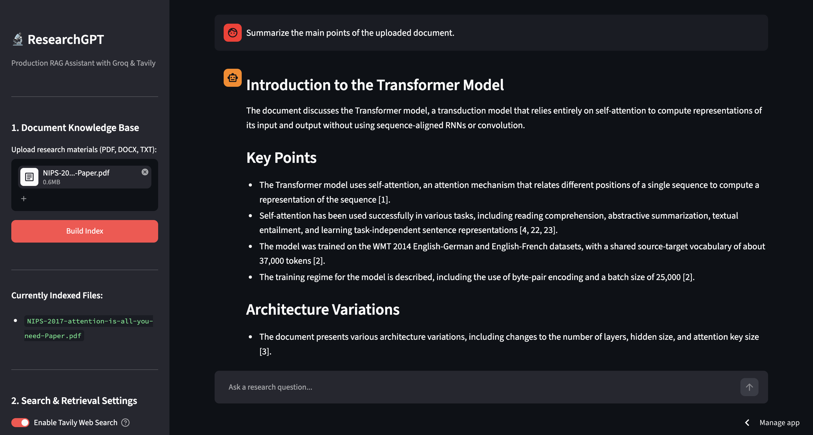
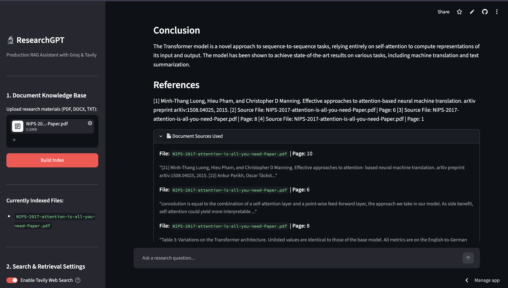

# 🚀 ResearchGPT — Modular Hybrid RAG & Web Research Agent

> **ResearchGPT** is an enterprise-grade Generative AI research assistant that combines **Local Document Retrieval (FAISS)**, **Real-Time Web Search (Tavily)**, and **Ultra-Fast LLM Inference (Groq + Llama 3.3)** into a unified **Hybrid Retrieval-Augmented Generation (RAG)** pipeline.

🌐 **Live Demo:** https://yb-researchgpt.streamlit.app

---

# 📌 Features

* 📄 Upload and analyze PDF, TXT, and other supported documents
* 🧠 Hybrid RAG pipeline using local documents + live web search
* ⚡ Ultra-fast inference powered by Groq LPU
* 🔍 Real-time web search using Tavily API
* 📚 FAISS vector database for semantic retrieval
* 🤖 HuggingFace embeddings (`all-MiniLM-L6-v2`)
* 🧩 Modular and scalable architecture
* 🎨 Interactive Streamlit interface

---

# 📂 Project Structure

```text
GEN-AI-Projects/
└── ResearchGPT/
    ├── data/                  # Cached processed data
    ├── logs/                  # Application logs
    ├── uploads/               # User uploaded files
    ├── vectorstore/           # Persisted FAISS index

    ├── src/
    │   ├── __init__.py
    │   ├── cleaner.py         # Text cleaning & normalization
    │   ├── embeddings.py      # HuggingFace embedding model
    │   ├── llm.py             # Groq LLM client
    │   ├── loader.py          # Multi-format document loader
    │   ├── logger.py          # Logging utilities
    │   ├── rag.py             # Hybrid RAG orchestration
    │   ├── search.py          # Tavily Web Search
    │   ├── splitter.py        # Text chunking
    │   └── vector_store.py    # FAISS vector database

    ├── app.py                 # Streamlit application
    ├── config.py              # Configuration settings
    ├── requirements.txt
    ├── README.md
    ├── .env
    └── .gitignore
```

---

# 🏗️ System Architecture

```text
                         ┌────────────────────┐
                         │  Uploaded Document │
                         └─────────┬──────────┘
                                   │
                                   ▼
                     ┌─────────────────────────────┐
                     │     Document Loader         │
                     └─────────┬───────────────────┘
                               │
                               ▼
                     ┌─────────────────────────────┐
                     │ Cleaner & Text Processing   │
                     └─────────┬───────────────────┘
                               │
                               ▼
                     ┌─────────────────────────────┐
                     │ Recursive Text Splitter     │
                     └─────────┬───────────────────┘
                               │
                               ▼
                     ┌─────────────────────────────┐
                     │ HuggingFace Embeddings      │
                     └─────────┬───────────────────┘
                               │
                               ▼
                     ┌─────────────────────────────┐
                     │      FAISS Vector Store     │
                     └─────────┬───────────────────┘
                               │
                               │
                 Local Context │
                               ▼
               ┌──────────────────────────────────┐
               │         Hybrid RAG Engine        │
               └──────────────┬───────────────────┘
                              │
          ┌───────────────────┴───────────────────┐
          │                                       │
          ▼                                       ▼
 Local Document Context                 Tavily Web Search
          │                                       │
          └───────────────────┬───────────────────┘
                              ▼
                     Groq Llama 3.3 LLM
                              │
                              ▼
                      Generated Response
                              │
                              ▼
                        Streamlit UI
```

---

# ⚙️ Technology Stack

| Layer                      | Technology                        |
| -------------------------- | --------------------------------- |
| **Frontend**               | Streamlit                         |
| **Programming Language**   | Python 3.11                       |
| **LLM**                    | Groq (Llama 3.3)                  |
| **Embeddings**             | HuggingFace `all-MiniLM-L6-v2`    |
| **Vector Database**        | FAISS                             |
| **Web Search**             | Tavily API                        |
| **Chunking**               | Recursive Character Text Splitter |
| **Document Processing**    | LangChain                         |
| **Environment Management** | python-dotenv                     |

---

# 🚀 Installation

## 1. Clone the Repository

```bash
git clone https://github.com/afsa-yb/GEN-AI-Projects.git

cd GEN-AI-Projects/ResearchGPT
```

---

## 2. Create a Virtual Environment

### macOS / Linux

```bash
python3 -m venv venv

source venv/bin/activate
```

### Windows

```bash
python -m venv venv

venv\Scripts\activate
```

---

## 3. Install Dependencies

```bash

pip install -r requirements.txt
```

---

## 4. Configure Environment Variables

Create a `.env` file in the project root.

```env
GROQ_API_KEY=gsk_your_api_key

TAVILY_API_KEY=tvly_your_api_key
```

---

## 5. Launch the Application

```bash
streamlit run app.py
```

---

# 💡 How It Works

1. Upload one or more documents.
2. Documents are cleaned and split into semantic chunks.
3. Chunks are converted into embeddings.
4. Embeddings are stored in a FAISS vector database.
5. User submits a research query.
6. Relevant local context is retrieved from FAISS.
7. Latest information is fetched from Tavily Web Search.
8. Both contexts are merged.
9. Groq's Llama 3.3 generates an accurate, context-aware response.
---
## 🔍 Source Attribution & Citation Tracking UI

To eliminate LLM hallucinations and ensure enterprise-level factual accuracy, **ResearchGPT** provides full transparency into every retrieve-and-generate cycle through granular document attribution.

![ResearchGPT UI Citation Feature]



### 🌟 Key Capabilities
* **Inline References & Synthesis:** The RAG pipeline automatically tags answer points with inline references pointing directly to the source document and page number.
* **Interactive Source Inspector (`st.expander`):** Users can toggle open the **"📄 Document Sources Used"** drawer under any generated response to inspect raw context.

---

# Tested in 5 phases 

Phase 1: Basic LLM & UI Sanity Check — Tests Groq LPU inference speed and verifies smooth, real-time output streaming in the Streamlit UI.

Phase 2: Real-Time Web Research (Tavily Integration) — Validates live web search execution, up-to-date fact retrieval, and automatic source citation extraction.

Phase 3: Local Document Ingestion & RAG Engine (FAISS) — Verifies the document processing pipeline from text cleaning and chunking to vector embedding and FAISS indexing.

Phase 4: Hybrid Research & Stress Test — Evaluates system stability when simultaneously merging local document context and live web search data.

Phase 5: UI & Session Persistence — Confirms multi-turn conversational memory, state retention across user re-renders, and clean session resets.
---

# ☁️ Deployment

The application is deployed on **Streamlit Community Cloud**.

**Live Demo**

https://yb-researchgpt.streamlit.app

---

# 📦 Dependencies

Major libraries used:

* Streamlit
* LangChain
* FAISS
* HuggingFace Transformers
* Sentence Transformers
* Groq
* Tavily
* python-dotenv

---

# 📄 License

This project is licensed under the **MIT License**.

See the `LICENSE` file for more details.

---

# 👩‍💻 Author

**Afsa Bhas**

* GitHub: https://github.com/afsa-yb

---

# ⭐ If you found this project helpful...

Give it a ⭐ on GitHub and feel free to contribute or share feedback!
